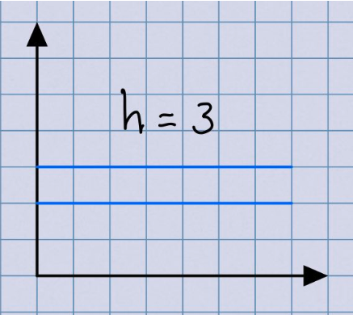
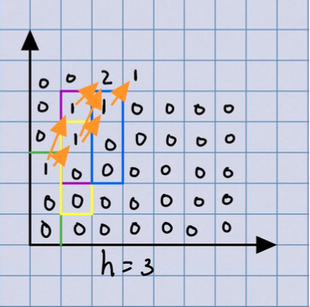
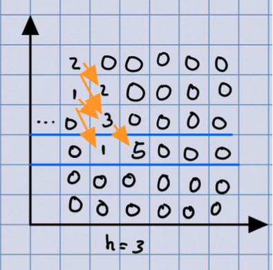

# EA Problem Report
### Contributors
* Duarte Dias 2018293526 duartedias@student.dei.uc.pt
* Maria Dias 2018274188 mddias@student.dei.uc.pt

## Algorithm Description
### Glossary
* 𝐻 - Height Limit given in problem
* h - Height of block
* 𝑛 - Number of blocks

This problem can be reduced to the calculation of all possible bitonic sequences for a given height and size, given a starting height. Therefore it can be separated in 2 parts:
1. Calculating all the strictly increasing monotonic sequences; 
2. Calculating all strictly decreasing monotonic sequences.

### Storage and Matrices
There are 2 𝐻 × 𝑛 (maxHeight by number of blocks) matrices. One of the matrices is used to store the overlapping problems of the strictly increasing arcs and the other is used to store the overlapping problems of the strictly decreasing arcs. The row ( h − 1) (-1 due to 0-starting index) is considered the home row, this means no block’s topmost element can go under said height.

Home Row
### Overlapping Subproblems
In this problem there are 2 types of overlapping subproblems:
* Strictly Increasing monotonic Sequences: the number of possible combinations of positions that 𝑖 + 1 blocks can take overlaps with the number of possible combinations of positions that a I blocks can take. This means that 𝑖 + 1blocks can only take h − 1 positions that connect them to 𝑖 Blocks.

Overlapping SubProblems “Going Up”
* Strictly Decreasing monotonic Sequences:the same logic applies to the strictly decreasing monotonic sequences, the sequences that 𝑖 + 1 blocks can take strictly depend on I blocks.
It is important to note that since we are talking strictly monotonic sequences the linkage between 𝑖 and 𝑖 + 1 blocks needs to incur a shift of at least 1 block (up or down).

Overlapping SubProblems “Going Down”

### The Solution
The Algorithm follows a simple 3-step bottom-up structure.
The following procedure is applied for every row (except the last):
1. It starts by calculating all the monotonically increasing sequences of the 𝑖 + 1 row (by exploring the overlapping properties discussed above), using a rolling sum, such that it can calculate each cell in 𝑂(1), and storing them in matrix1.
2. Starting from the top-most non-zero index of the current row of matrix 1, the process is repeated ( rolling sum, exploring the overlapping problems), and the values are stored in row 𝑖 + 1 of matrix2.
3. Finally, (2) is applied to row 𝑖 of matrix2.
   
After the algorithm finishes filling all the needed cells, the solution should be
stored in the “home row”, to which we can just do a simple sum.

### SpeedUp Techniques
* Aside from the mentioned dynamic programming structure, the speedup Techniques used were:
* Rolling sum of Elements , which ensures that each cell is calculated in 𝑂(1).
* Indexation, making sure that no extra unneeded indexes are calculated, by breaking cycles earling when the rolling sum is 0, and starting from 0 or H, but from the topmost or bottommost non-zero cells.
## Data Structures
To solve this problem a C-like Array was used.
Whilst such structures like these are dangerous and may have some strange behaviours when used in C++, in this case, a static allocation in the beginning of the program does not represent danger to the final results.

## Correctness
    Score: 200 Points;
Initially the algorithm used a top down schema that used the same 2 auxiliary arrays to store the possible combinations for a block in a position (blockNr, height). This solution does overlap the adjacent sequences to the left and right, and therefore takes much longer, than the current bottom-up Algorithm;
## Algorithm Analysis

### Memory
To solve this problem 2 arrays were created according to the bounds given in the problem Statement. Therefore, the total memory cost is (where 4 refers to the type of data (int)):
$$2 × 60001 × 501 × 4 𝑏𝑦𝑡𝑒𝑠$$ 
Which reflects in:
$$ 2 × 𝑂(𝑛 × 𝐻)$$

### Time
Whilst it is hard to come up with a precise complexity for this approach, it takes approximately :
$$2×𝑂(𝑛 ×𝐻) + 3𝑂((𝐻 − h) * 𝑛)≈𝑂(𝑛 ×𝐻) $$
Where the first member represents the time required to initially 0-fill all the cells of the 2 matrices.
    
    

## References
* Algorithms, Jeff Erikson