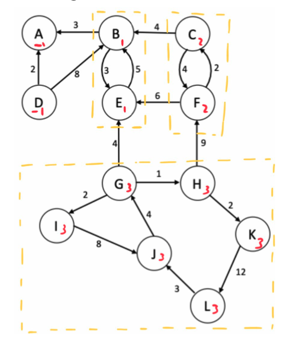
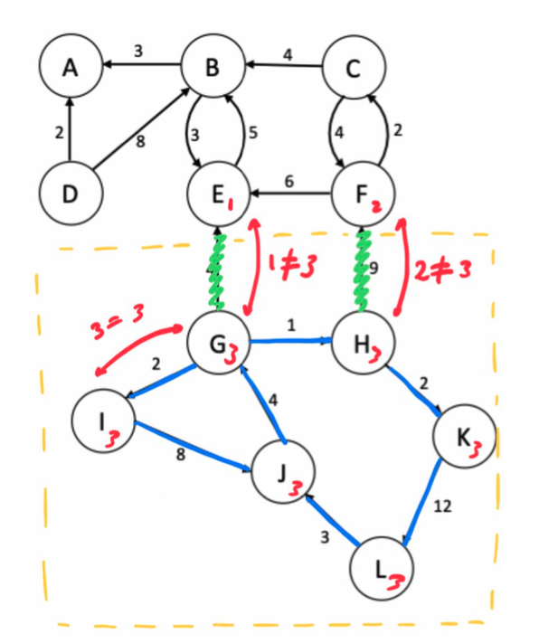

# EA Problem Report
### Contributors
* Duarte Dias 2018293526 duartedias@student.dei.uc.pt
* Maria Dias 2018274188 mddias@student.dei.uc.pt

## Algorithm Description
The Problem in hands can be solved by an almost direct application of 2 well-known algorithms, Tarjan and Kruskal, with few implementation tricks to keep in mind.

## Circuit Identification
Identifying the circuits (i.e. the loops) can be done by calculating the Stronglyconnected components.Thiscanbedonebyadirectapplicationofthe Tarjan Algorithm. All the SCC’s are stored in a vector<vector<int>>, where the innermost vector stores all the vertices of a component, and the outermost vector stores all the components. This allows us to respond to the first two questions.

## Selection of the streets for the bike lanes
To answer the 2 remaining questions, the Kruskal Algorithm is used. From 1.1 to 1.2 there is a preprocessing stage where all the edges are stored in a vector,according to their respective component. This preprocessing stage only stores edges such that their connection is inside the SCC (see image 2). This can be done in O (V + E) by first creating a vector of size V, and assigning each vertex the number to which SCC they belong. After that, and when running through the adjacency list of each vertex in an SCC, said edge is only added if both the vertices have the same SCC number (i.e. they are in the same SCC). After this step, the default Kruskal algorithm is run for each component.

Vertex Component Identification

Edge Selection

## Data Structures
The core data Structures used in this problem where:
* Adjacency List (implemented by having a class Node with a vector<pair<int, int>> where the pair represents the other node’s id and respective weight>), used to store the vertex data initially;
* Stack (implemented by using std::vector), used in the Tarjan Algorithm;
* Union Find Structure, Used in the Kruskal Algorithm.
  
## Correctness
    Score: 200 Points
In this problem there were no major problems nor speedup techniques, the final score of 200 Points was obtained at the first try. In this case this problem was an almost direct Tarjan + Kruskal Implementation.

## Algorithm Analysis
V - Vertex (Nr of vertices) 
E - Edges (Nr of edges)
### Memory
    
* The initial storage in an adjacency list implies the total cost of E; 
* Tarjan
  * There are 2 vectors of size V, for the Tarjan Algorithm (low and dfs);
  * A stack that stores the SCC components, size V.
* Pre processing : re-storing all edges , size E; ● Kruskal
* 2 vectors of size V;
$$𝑂( 𝐸 + 2𝑉 + 𝑉 + 𝐸 + 2𝑉) ∼ 𝑂(𝐸 + 𝑉)$$

### Time
* Tarjan:
  * O(|V| + |E| x V), since the search for the elements in the
stack is not done in O(1) but in O(n) (linear search);
* Pre-processing
  * O(|V| + |E|), parse each node per vertex once. 
* Kruskal
  * (E log V) , sorting and running the algorithm 
* Overall
$$𝑂(𝐸𝑙𝑜𝑔𝑉+ (|𝐸| + |𝑉| ) × 𝑉)$$
The clear bottleneck is the stack search in N which could be easily changed to O(1), which was not required to get 200 Points but was marked as Nr.1 on the list if improvements were necessary;
    
    

## References
* Halim, S, Halim, F & Suhendry, E 2020, Competitive Programming 4